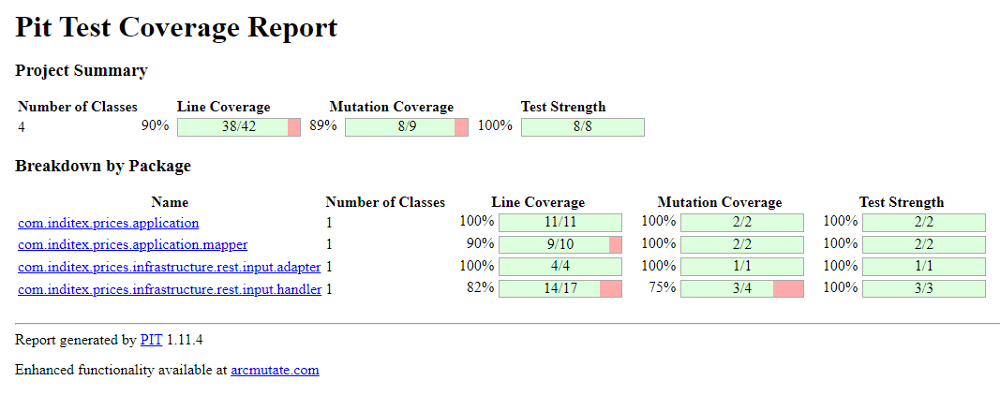

# Price-management
**Price management** es un proyecto basado en **Arquitectura Hexagonal** que se encarga de obtener la tarifa
que aplica a un producto de una cadena (**Zara**) entre unas fechas determinadas.

## 📋 Características del proyecto
### Formateo código (Google-Java-Format)

Con los siguientes comandos formateamos el código fuente, otorgando legibilidad y consistencia al código.
```
mvn com.coveo:fmt-maven-plugin:format
mvn com.coveo:fmt-maven-plugin:check
```

### Gestión de calidad (Checkstyle)

Con el siguiente comando se ejecutará el proceso de análisis de código Checkstyle que comprobará si el código fuente
cumple con las reglas de codificación.
```
mvn checkstyle:checkstyle
```
>**NOTA:** Por problemas de incoherencias que puedan surgir, se recomienda primero aplicar el correspondiente formateo
> de código antes de ejecutar el proceso de análisis de código **Checkstyle**.

### Documentación de la API

Para ver la documentación referente a la API de una manera más cómoda necesitaremos copiar el siguiente documento
[api.yaml](src/main/resources/swagger/api.yaml) en el [Swagger Editor](https://editor.swagger.io/).

### API Testing
[Coleccion de pruebas de Postman] Ver fichero "Price Management Collection.postman_collection.json".

### PIT Mutation Testing

Para poder generar el informe de **PITest** referente al proyecto será necesario hacerlo usando el siguiente comando:
```
mvn test-compile org.pitest:pitest-maven:mutationCoverage
```

Esto generará una carpeta (pit-reports) dentro del target del proyecto. Dicha carpeta a su vez tendrá un fichero
index.html que se podrá abrir en el navegador y explorar el informe de testing generado.


## ️ ⚙️ Ejecución ️y configuración

Para ejecutar la aplicación bien se puede hacer accediendo a la clase PriceManagementApplication o bien ejecutando
los siguientes comandos.

### Instalación del artefacto en local.
```
mvn clean install
```

### Empaquetado el proyecto
```
mvn clean package
```

### Ejecución del proyecto
```
mvn spring-boot:run
```

### Ejecución del proyecto exceptuando tests
```
mvn clean package -DskipTests
```

### Ejecución de tests
```
mvn test
```

###  Base de datos en memoria h2

La ejecución de la API habilitará una base de datos en memoria que se puede encontrar en
http://localhost:8080/h2-console.

`JDBC URL:`jdbc:h2:mem:pricesdb

`Username:` sa

`Password:`


